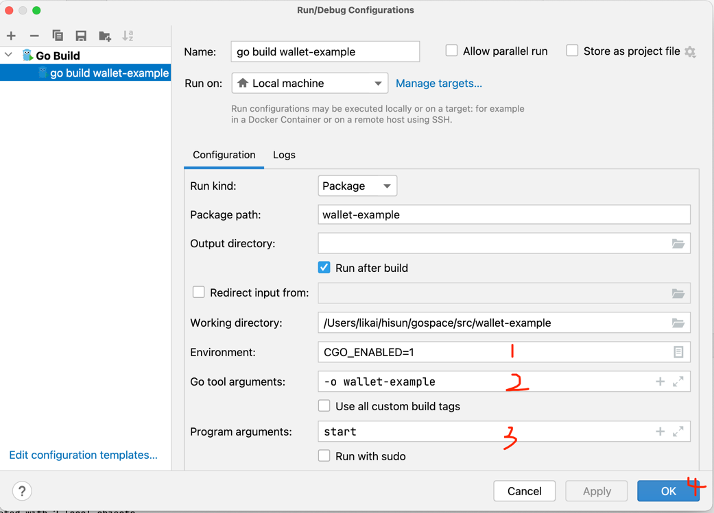
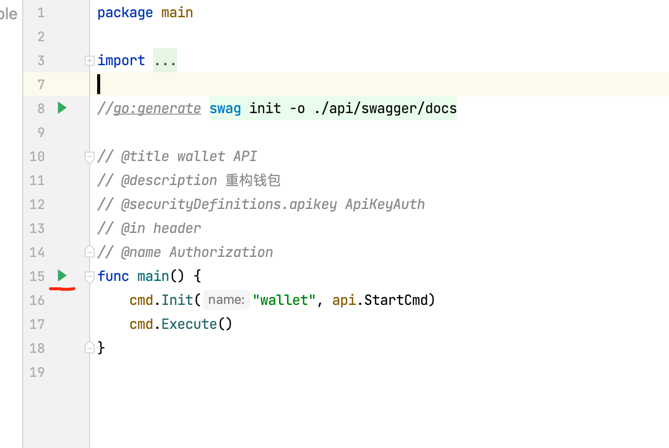

# wallet-example

## 快速开始

### git clone

> $ git clone git@github.com:likai1130/wallet-example.git

### go mod

> $ go mod tidy

### 本地运行
#### 方式一

- 配置idea

    

- main.go 执行 main方法

    

#### 方式二

> $ CGO_ENABLED=1  go build -a -v -installsuffix cgo -o wallet-example

> $ ./wallet-example start -c config/settings.yml


## 使用k2 示例

- 业务代码放在internal目录，新建admin目录

  > $ mkdir -p admin
  
- 使用代码生成工具，创建tools，创建json元数据文件. [元数据json示例](./internal/admin/tools/kx_position.json)

  > $ mkdir -p tools

  > $ touch kx_position.json

- 将命令行工具复制到admin目录下

  > $ cp ./wallet-example ./internal/admin

- 自动生成代码
  
  >   $ cd ./internal/admin
  
  >   $ ./wallet-example generate ./tools/kx_position.json
  
    ```
    Generating code skeletons...
    2022/11/30 12:12:00 file models/tb_position.go generated.
    2022/11/30 12:12:00 file apis/tb_position.go generated.
    2022/11/30 12:12:00 file router/tb_position.go generated.
    2022/11/30 12:12:00 file web/src/api/wallet-example/internal/admin/tb-position.js generated.
    2022/11/30 12:12:00 file web/src/views/wallet-example/internal/admin/tb-position/index.vue generated.
    2022/11/30 12:12:00 file service/dto/tb_position.go generated.
    2022/11/30 12:12:00 file service/tb_position.go generated.
    Code generated successfully！
    ```
- 查看admin 目录结构

  ```
    ...
    .
    ├── apis
    │   └── tb_position.go
    ├── controller
    │   └── sys
    ├── models
    │   └── tb_position.go
    ├── router
    │   ├── router.go
    │   ├── sys_router.go
    │   └── tb_position.go
    ├── service
    │   ├── dto
    │   └── tb_position.go
    ├── tools
    │   └── kx_position.json
    ├── wallet-example
    └── web
        └── src
    ...
  ```
  
- 将router加入系统启动

  - wallet-example/cmd/api 新建admin.go

    ```
    package api
  
    import "wallet-example/internal/admin/router"
  
    func init() {
      //注册路由 fixme 其他应用的路由，在本目录新建文件放在init方法
      AppRouters = append(AppRouters, router.InitRouter)
    }
    ```
    
## Docker

> $ docker build --no-cache -t wallet-example:v0.0.1 .


